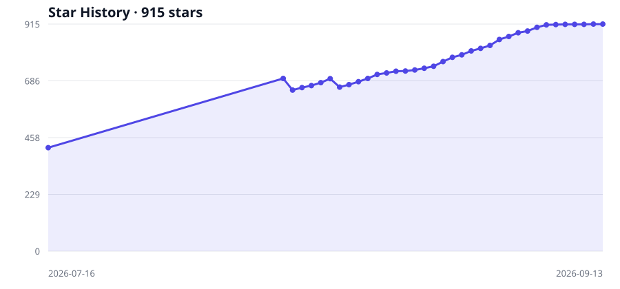

# FridayOS 1.0

### Start with an AI second brain. Explore a more human-centered Agent OS.

**FridayOS 1.0 is an open-source practice project from [Robinson AI Lab](https://github.com/Robinson-AI-Lab), formerly named FridayOS-Lite.** It continues to evolve from the original knowledge-management practice.

Robinson is a public-interest AI research community focused on AI management concepts, practical experiments, and open sharing. FridayOS is our flagship initiative for connecting human knowledge, experience, and action with AI.

English · [简体中文](./README.zh-CN.md) · [About the lab](./LAB.md) · [Questions and feedback](https://github.com/Robinson-AI-Lab/FridayOS1.0/issues)

## What this version provides

Use **Obsidian + Claudian**, local Markdown files, and a brain blueprint to explore AI-assisted personal knowledge management: capturing notes, organizing information, retrieving context, and learning a six-region knowledge structure. Setup guides and a fictional demo provide a practical starting point.

This version focuses on personal knowledge management. A Feishu bot, automated message capture, and a complete set of operational safeguards are outside its current scope. Broader task collaboration and Agent OS capabilities remain ongoing research directions.

By **Agent OS**, we mean a collaboration environment connecting AI agents, knowledge, tools, and tasks. Our aim is to make that environment approachable, understandable, and respectful of human judgment and control.

## Who it is for

People curious about AI who want help remembering, organizing, and finding information, and are willing to follow a guide and share what they learn. Prior software-development experience is not required.

## In three lines

1. **A folder is your brain** — all notes as local plain text, never locked in.
2. **An AI lives in your notes app** — chat with Friday in Obsidian's sidebar; it captures, organizes, and retrieves.
3. **You don't build the brain** — download [`FRIDAY-BLUEPRINT.md`](./FRIDAY-BLUEPRINT.md), tell Friday "build from this", and the six regions appear by themselves.

## 💡 This way of working has a name: Vibe Knowledge Management

You've heard of vibe coding — say what you want, the AI writes the code. **Vibe Knowledge Management (VKM)** is the same move applied to knowledge: **drive your knowledge base with natural language, and let the AI do the managing.** You never create folders, tag notes, or fix links by hand. You just talk — capture a stray thought, ask a question, say "the usual" — and filing, linking, and retrieval are Friday's job.

VKM is the core of Friday, and FridayOS 1.0 is its smallest complete form. Fair notice: this is a new way of working — how well it replicates beyond us, and how quickly newcomers internalize it, still needs more users to verify. **That's exactly what this repo is for.**

## 🗺️ How it fits together

> Indigo = what you touch; teal = what thinks beneath. See [`TOOLS.md`](./TOOLS.md) for what each tool is and why.

## 🚀 Get started (three steps)

| Order | Read | Do |
|---|---|---|
| 1️⃣ Understand | [`TOOLS.md`](./TOOLS.md) | 3 min — what the five tools are for |
| 2️⃣ Install | [`INSTALL.md`](./INSTALL.md) | Set up the stack, then one sentence builds the brain |
| 3️⃣ If stuck | [`FAQ.md`](./FAQ.md) | Troubleshooting + download links |

> 👉 **Beginners: go 1→2→3, don't skip.** Understand first, then install.

## 🧠 Your brain after setup

Six regions, fully explained in [`FRIDAY-BLUEPRINT.md`](./FRIDAY-BLUEPRINT.md):

| Region | Folder | In a line |
|---|---|---|
| 📥 Inbox | `inbox/` | Capture fast, sort later |
| 🎯 Workbench | `exec/` | 3–7 things in motion + weekly/daily plans |
| 📚 Knowledge | `wiki/` | Worth keeping, wikilinked |
| ⚙️ Skills | `skills/` | Repeated work as routines (advanced) |
| 📦 Archive | `raw/` | Source material, read-only |
| 🫀 Core | `system/` | The brain's contract (`CLAUDE.md`) |

## 🎮 Just installed and feeling lost? Play the demo brain

An empty brain is hard to appreciate. We ship a **ready-to-play sandbox** — a fictional 100-person IT company with full employee files, projects, customers, all wikilinked across the six regions, plus 11 demo prompts in three acts for exploring retrieval and cross-file analysis. To play: download [`示例大脑-云栈科技.zip`](./示例大脑-云栈科技.zip) (click the ⬇ download button), unzip, open as a vault, follow the demo manual inside. *(Demo content is Chinese-only.)*

## 💸 Token-frugal by design

The six regions aren't just tidy — **they're what makes Friday absurdly cheap to run**. Aggregate queries scan structured frontmatter (dozens of tokens per file) instead of whole documents; every domain has an overview map (MOC) so Friday starts from one page, not eleven; questions open only the region they belong to; and routines live in `skills/` once, invoked by name instead of re-explained every time.

Model costs depend on the provider, model, context size, and usage. Evaluate costs using your own usage records and validate results in your environment.

## 📦 Tools you'll install (all free / very cheap)

| Tool | Role | From |
|---|---|---|
| Node.js | Foundation | [nodejs.org](https://nodejs.org) |
| Obsidian | The brain's body (notes app) | [obsidian.md](https://obsidian.md) |
| Claude Code | Friday's engine (the AI) | npm (China mirror) |
| cc-switch | Wires the engine to a cheap chip | [ccswitch.io](https://ccswitch.io) |
| DeepSeek V4 | Cheap, no-VPN model | [platform.deepseek.com](https://platform.deepseek.com) |
| Claudian | Brings the AI into Obsidian | Obsidian community plugin |

## Star History

Verified observations; collected daily from 2026-08-11. Missing dates are not reconstructed from the current stargazer list.

## 💬 Stuck?

Bug reports and questions are welcome on the [Issues](https://github.com/Robinson-AI-Lab/FridayOS1.0/issues) page.

---

FridayOS 1.0 · One document, one sentence, one brain.

